# Manual de Utilizador - Blokus Uno

## Inteligência Artificial - Projeto 1

Grupo:

- André Serrado 201900318

- Gabriel Pais 201900301

Docente:

- Filipe Mariano

Este manual de utilizador visa facilitar o compreensão do problema apresentado, e por consequinte facilitar também a sua resolução. O projeto teve como principal objetivo, a procura de soluções para os tabuleiros pré-fabricados, recorrendo à utilização de algoritmos de procura. Este projeto foi também desenvolvido, exclusivamente com a linguagem Lisp.

## Índice

- [Objetivo do Jogo](#objetivo-do-jogo)
- [Descrição Geral](#descricao-geral)
- [Informação Necessária](#informacao-necessaria)
- [Informação roduzida](#informacao-necessaria)
- [Limitações do Programa](#limitacoes-do-programa)

---

## [Objetivo do Jogo](#Objetivo-do-jogo)

- Considera-se uma versão simplificada do jogo **_Blokus_**, conhecida por **_Blokus Uno_**.

- Pretende-se desenvolver um programa que indique a sequência de passos que conduzem de uma posição inicial do tabuleiro (contendo posições previamente preenchidas), até uma posição final em que o objetivo é atingido.

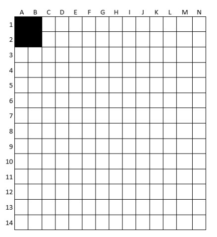

## [Descrição Geral](#descricao-geral)

### [Principais diferenças](#principais-diferencas)

- Em blokus Uno existe apenas um jogador. Para efeitos de melhor compreensão, este jogador se serão os métodos de procura desenvolvidos.

- O jogo, habitualmente, termina quando todas as peças tiverem sido colocadas ou não for possível colocar mais peças respeitando as regras.

- No caso do projeto, cada problema disponibilizado tem um número objetivo de casas/elementos preenchidos no tabuleiro. Quando este número de casas/elementos é atingido é achada uma solução possível. É ainda possível não haverem peças suficientes para preencher o número de casas pretendidas.

- Tendo isto, para esta variante do jogo estarão disponíveis 10 peças do tipo "A", 10 do tipo B e 15 do tipo c-1 e c-2 em conjunto.

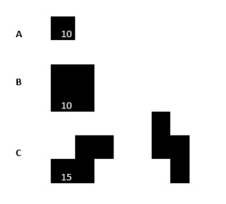

### [Funcionamento Geral](#funcionamento-geral)

- O número 0 para casas vazias
- O número 1 para casas ocupadas com peças
- O número 2 para casas bloqueadas

  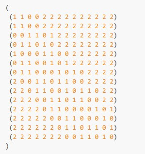

As peças não podem estar adjacentes umas às outras, e deve existir pelo menos uma de um certo tipo para poder ser inserida.

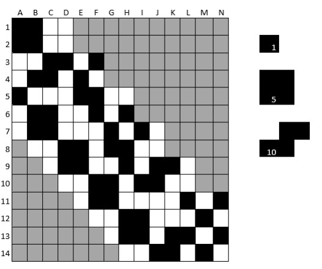

---

### Tabuleiros Disponíveis e objetivos

#### Problema-a - objetivo 8 casas preenchidas

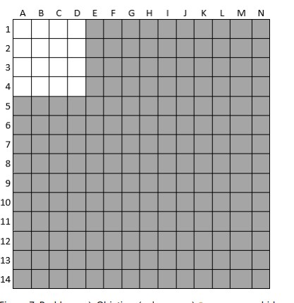

---

#### Problema-b - objetivo 20 casas preenchidas

## 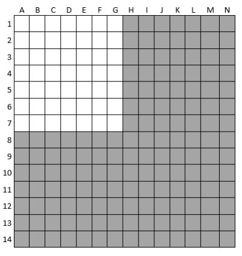

#### Problema-c - objetivo 28 casas preenchidas

## 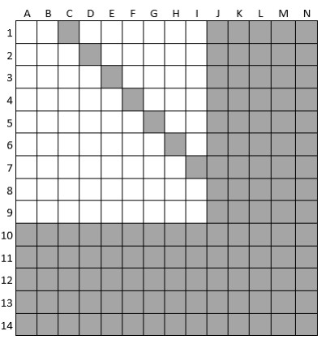

#### Problema-d - objetivo 36 casas preenchidas

## 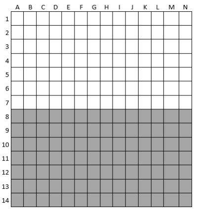

#### Problema-e - objetivo 44 casas preenchidas

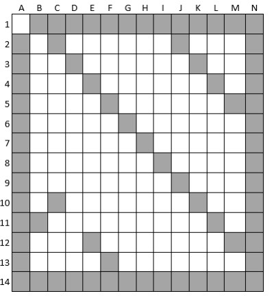

---

#### Problema-f - objetivo 72 casas preenchidas

## 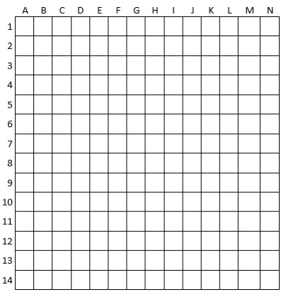

## [Informação produzida](#ecrã-teclado-e-ficheiros)

Inicialmente será apresentado um menu de interação com o utilizador. Para começar o programa deverão ser lidas e seguidas as instruções de [Limitacoes do Programa](#limitacoes-do-programa) e, apenas após poderá ser inserido o comando:

```lisp
(start)
```

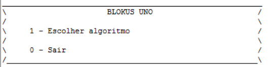

!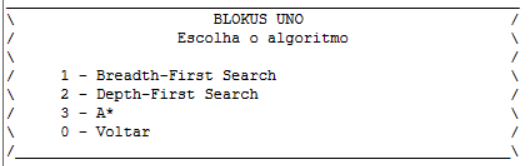

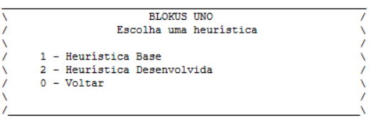

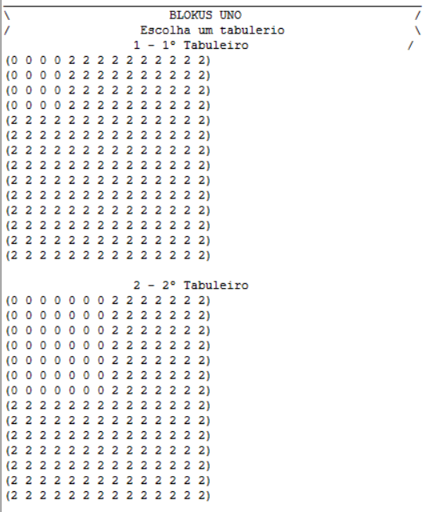

Após a execução do programa será criado um ficheiro ".dat" com o output do mesmo. Este ficheiro de output terá no seu conteúdo as soluções do problema executado bem como as suas estatísticas.

## [Limitacoes do Programa](#limitacoes-do-programa)

Para que o projeto produza o resultado pretendido, todos os ficheiros .lisp diponibilizados deverão ser executados. Além disso, é ainda necessário que o "path" para os ficheiros seja alterado para que estes sejam compilados com sucesso! Este "path" pode ser encontrado no ficheiro _projeto.lisp_.
